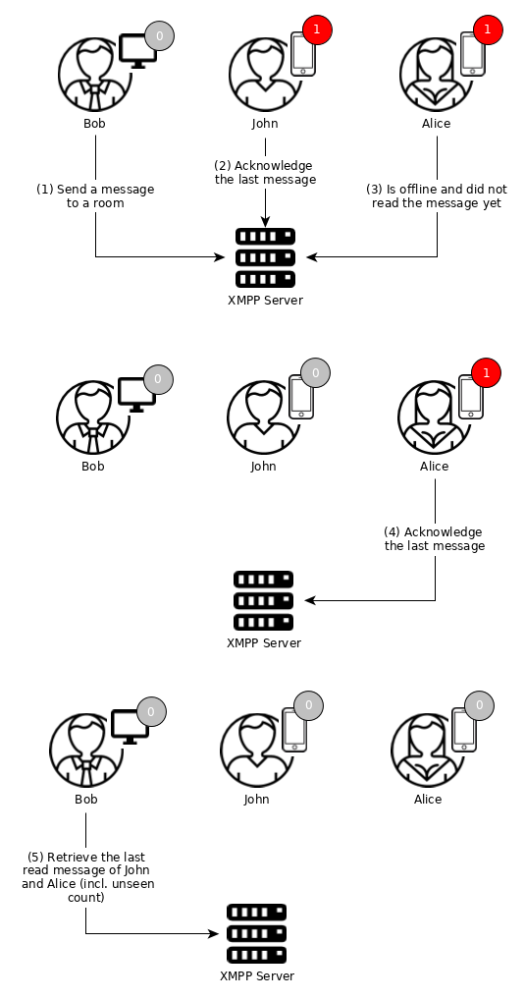

# ejabberd-unread Concept Paper

## Table of contents

- [Table of contents](#table-of-contents)
- [Terminology](#terminology)
- [Prequel](#prequel)
- [Glossary](#glossary)
- [Introduction](#introduction)
  - [Requirements](#requirements)
- [Workflow](#workflow)
- [Stanza API](#stanza-api)
  - [Mark a message as read (single message)](#mark-a-message-as-read-single-message)
  - [Mark all messages of a conversation as read](#mark-all-messages-of-a-conversation-as-read)
  - [List all unread counts of all conversations (own perspective)](#list-all-unread-counts-of-all-conversations-own-perspective)
  - [List last read message per user of a conversation (peer perspective)](#list-last-read-message-per-user-of-a-conversation-peer-perspective)
  - [Fetch messages of a conversation from archive](#fetch-messages-of-a-conversation-from-archive)
- [Implementation](#implementation)
  - [ejabberd module](#ejabberd-module)
  - [Database schema](#database-schema)

## Terminology

In this document, the key words `MUST`, `MUST NOT`, `REQUIRED`,
`SHALL`, `SHALL NOT`, `SHOULD`, `SHOULD NOT`, `RECOMMENDED`, `MAY`,
and `OPTIONAL` are to be interpreted as described in BCP 14, RFC 2119.

## Prequel

* https://xmpp.org/extensions/xep-0012.html
* https://xmpp.org/extensions/xep-0333.html
* https://github.com/processone/ejabberd/issues/1988#issuecomment-329434809

## Glossary

* **Conversation**: Either a group or direct chat of users
* **Group Chat, Room**: An XMPP multi user conversation (MUC), an XMPP entity
* **Direct Chat**: A user talks directly to another user, there are only two
  users involved
* **XMPP presence application**: All short- and long lived
  applications which subscribes to or publishes contents via the XMPP
  protocol
* **XMPP client application**: A general user client which enables the user to
  view messages and write new ones. (eg. Maklerportal Frontend, the HAUSGOLD
  CRM iOS app)

## Introduction

This concept features a custom implementation of the XEP-0333 extension in its
core. It is spiced with requirements directly associated to HAUSGOLD and could
be partially/fully used by third parties.

The goal of the implementation is to persist the unseen/unread messages of all
conversations of a user on the central XMPP service, while allowing him to
acknowledge individual messages per conversation. No matter of the device a
user is using we want be able to know which were the (un)seen/(un)read
messages. This is especially important for cross-device users. (Eg. mobile iOS
app and reactive web app on a desktop machine) Any client/presence application
MUST be able to send (acknowledge) and retrieve the (un)seen/(un)read messages
per conversation by a simple iq stanza.

### Requirements

1) Allow users to acknowledge each message individually per conversation from
   their perspective (eg. notification stream)
2) Allow users to acknowledge all messages of a single conversation from their
   perspective (Whatsapp read until markers)
3) Get a list of all conversations with their respective unread messages counts
   (eg. red bubbles per conversation)
4) When fetching the message archive (MAM), each message contains an indicator
   if the message is unread or not, from the perspective of the user (eg. a new
   messages separator on a chat)

## Workflow



1. Bob sends a message to a room

    The first step is that Bob decides to send a message to a room were he is
    members along with John and Alice. He sends the message, so the XMPP
    service SHALL automatically mark his last message as read he was sending
    right now. Two unread messages were added, one for John and one for Alice
    on that room.

2. John is online and marks the message as read

    Fortunately John is online and has opened the chat room for a while.
    He directly sees the new message from Bob and his App sends an
    mark as read request to the XMPP server. The App is RECOMMENDED to send
    the mark as read request at least after 2 seconds after the last
    message is displayed on screen (only on focused windows).

3. Alice is offline and did not read the message yet

    Unfortunately Alice is offline and her mobile device is locked in her
    pocket.

4. Alice comes online and marks the message as read

    After a little while she picks it up and unlocks it and then she is
    browsing the App and comes back to the dashboard page. There she sees the
    unread message count of each conversation where she is a member of. The App
    SHALL query the unread message count for each room of Alice's dashboard.
    The App is RECOMMENDED to display the unread count when it is greater than
    zero, to visually notify the user.

5. Bob retrieve the last read message of John and Alice

    Bob is actively looking at the history of the chat room and waits for
    an anwer. His App MAY query the last read message of John and Alice on
    this room periodically to show an indicator that the message was read
    by all members. The XMPP server SHALL allow the querying of the last
    read message of another member of a room.

## Stanza API

The ejabberd-unread modules API is accessible via custom stanzas. The following
commands are supported and described in detail with examples.

### Mark a message as read (single message)

Marking a single message as read is straightforward an iq stanza which
specifies the message by its stanza id. Just send this changing iq stanza and
the service will take care of the data management. The counting requests are
directly affected by this change. It does not matter if you send a full user
JID or a bare JID as the sender (`from` attribute). You MUST send a bare JID as
the recipient (`jid` attribute on the `<ack>` element, bare room/MUC JID or a
bare user JID for direct chats).  The sender receives an empty iq result which
is delivered to the correct session.

```xml
<!-- Mark a message as read on a MUC, see the +to+ attribute -->
<iq from="alice@example.com/iphone"
    id="..."
    to="example.com"
    type="set">
  <ack xmlns="urn:xmpp:unread" id="1523085730748465"
       jid="test@conference.example.com" />
</iq>

<!-- Mark a message as read on a direct chat, see the +to+ attribute -->
<iq from="alice@example.com/iphone"
    id="..."
    to="example.com"
    type="set">
  <ack xmlns="urn:xmpp:unread" id="1523085730748465"
       jid="bob@example.com" />
</iq>
```

The resulting iq stanza looks like this:

```xml
<iq from="example.com"
    id="..."
    to="alice@example.com/iphone"
    type="result" />
```

The service MUST NOT validate the sent message stanza id which should be marked
as read. The client MUST provide a useful value to the service. The result does
not reflect the persistence of the acknowledgment. Errors MAY just be
swallowed.  The service SHOULD send the answer iq stanza to be XMPP conform,
even when the result is empty and therefore successful.

### Mark all messages of a conversation as read

It comes in handy to mark all messages on a specific conversation as read with
a single iq stanza. This allows clients to flush all unread messages at once
when entering a "dirty" room. The mechanism works just like the single message
marking, with the only difference that the id MUST be set to the special value
`all`. Here comes a sample request:

```xml
<!-- Mark all messages as read on a MUC, see the +to+ attribute -->
<iq from="alice@example.com/iphone"
    id="..."
    to="example.com"
    type="set">
  <ack xmlns="urn:xmpp:unread" id="all"
       jid="test@conference.example.com" />
</iq>

<!-- Mark all messages as read on a direct chat, see the +to+ attribute -->
<iq from="alice@example.com/iphone"
    id="..."
    to="example.com"
    type="set">
  <ack xmlns="urn:xmpp:unread" id="all"
       jid="bob@example.com" />
</iq>
```

The response is equal to the [Mark a message as read (single
message)](#mark-a-message-as-read-single-message) iq stanza.

### List all unread counts of all conversations (own perspective)

A client application MUST be able to fetch all unread message counts of all
conversations of the sender (current user identified by the iq stanza `to`
attribute). The service MUST NOT allow users to fetch all unread counts of
another user. The resulting iq stanza MUST carry a list of `<unread-messages>`
XML elements.

```xml
<iq from="alice@example.com/iphone"
    id="..."
    to="example.com"
    type="get">
  <query xmlns="urn:xmpp:unread" />
</iq>
```

The resulting iq stanza looks like this:

```xml
<iq from="example.com"
    id="..."
    to="alice@example.com/iphone"
    type="result">
  <!-- A MUC with unread messages -->
  <unread-messages jid="room42@conference.example.com" amount="5">

  <!-- A direct chat with unread messages -->
  <unread-messages jid="bob@example.com" amount="2">
</iq>
```

The service SHALL NOT paginate the result. The service MUST NOT include
`<unread-messages>` elements with zero counts.

### List first unread message per user of a conversation (peer perspective)

A client application SHALL be able to fetch the first (oldest) unread message
per user of a conversation. This MAY be used by the client to implement
Whatsapp-like message indicators on direct/group chats. The query iq stanza
looks almost equal to the iq stanza of [List all unread counts of all
conversations (own
perspective)](#list-all-unread-counts-of-all-conversations-own-perspective).
The only difference is the `<query>` XML element MUST have set the `jid`
attribute. This attribute represents the bare JID of the destination
(direct/group chat).

```xml
<!-- Fetch the last read message, per user of a MUC -->
<iq from="alice@example.com/iphone"
    id="..."
    to="example.com"
    type="get">
  <query xmlns="urn:xmpp:unread"
         jid="bob@example.com" />
</iq>

<!-- Fetch the last read message, per user of a direct chat -->
<iq from="alice@example.com/iphone"
    id="..."
    to="example.com"
    type="get">
  <query xmlns="urn:xmpp:unread"
         jid="muc@conference.example.com" />
</iq>
```

The resulting iq stanza looks like this:

```xml
<iq from="example.com"
    id="..."
    to="alice@example.com/iphone"
    type="result">
  <unread-message jid="bob@example.com" id="1568719009427128">
  <unread-message jid="john@example.com" id="1568719009428999">
</iq>
```

When an affiliated user of a MUC, or the direct chat peer read all messages of
the conversation, the service MUST NOT include the `<unread-message>` XML
element.

### Fetch messages of a conversation from archive

Any client/presence application can use the [XEP-0131, Message
Archive](https://xmpp.org/extensions/xep-0313.html) extension to fetch messages
from the archive. The ejabberd-unread extension adds a new `<unread>` XML
element inside the resulting `<message>` elements which signalize the
read/unread state of the message. This state is derived from the requested
(own) perspective. No additional handling is required at the message querying
side.

```xml
<!-- Fetch the MAM history of a MUC -->
<iq xmlns="jabber:client"
    id="c1a7e5ef-a18a-4b1f-b441-e3d71f5cd290"
    to="muc@conference.example.com"
    type="set">
  <query xmlns="urn:xmpp:mam:2"
         queryid="c1a7e5ef-a18a-4b1f-b441-e3d71f5cd290">
    <set xmlns="http://jabber.org/protocol/rsm">
      <max>100</max>
    </set>
    <x xmlns="jabber:x:data"
       type="submit">
      <field var="FORM_TYPE">
        <value>urn:xmpp:mam:2</value>
      </field>
    </x>
  </query>
</iq>

<!-- Fetch the MAM history of a direct chat -->
<iq xmlns="jabber:client"
    id="54701447-28af-4f04-9384-c654ed91b6df"
    type="set">
  <query xmlns="urn:xmpp:mam:2"
         queryid="54701447-28af-4f04-9384-c654ed91b6df">
    <set xmlns="http://jabber.org/protocol/rsm">
      <before />
      <max>25</max>
    </set>
    <x xmlns="jabber:x:data"
       type="submit">
      <field var="FORM_TYPE">
        <value>urn:xmpp:mam:2</value>
      </field>
      <field var="with">
        <value>
          05580265-d6ad-4642-bb86-8ad0d4931c5b@example.com
        </value>
      </field>
    </x>
  </query>
</iq>
```

See [XEP-0131, Querying an
archive](https://xmpp.org/extensions/xep-0313.html#query) for further details
on querying the message archive.

The resulting messages (matched messages of the query) MUST carry the new
`<unread>` XML element to signalize the read/unread state of the message to the
user. An example result looks like this:

```xml
<message xmlns='jabber:client'
         to='8db96273-9bb9-4aff-8581-7fbedb42c919@example.com/147'
         from='8db96273-9bb9-4aff-8581-7fbedb42c919@example.com'>
  <result id='1568719009427129'
          queryid='8d62ace9-bf91-46c6-a8ae-5ed722692c2a'
          xmlns='urn:xmpp:mam:2'>
    <forwarded xmlns='urn:xmpp:forward:0'>
      <message xml:lang='en'
               to='8db96273-9bb9-4aff-8581-7fbedb42c919@example.com'
               from='1be796d1-041e-470c-b168-8bac4ab49ba2@example.com/962'
               id='b6f86484-8f68-4fdf-af17-5a3f07026797'
               xmlns='jabber:client'>
        <archived by='8db96273-9bb9-4aff-8581-7fbedb42c919@example.com'
                  id='1568719009427129'
                  xmlns='urn:xmpp:mam:tmp' />
        <stanza-id by='8db96273-9bb9-4aff-8581-7fbedb42c919@example.com'
                   id='1568719009427129'
                   xmlns='urn:xmpp:sid:0' />

        <!-- This new XML element is added to each resulting message -->
        <unread xmlns='urn:xmpp:unread' state='true/false' />

        <body>Hey there!</body>
      </message>
    </forwarded>
  </result>
</message>
```

## Implementation

### ejabberd module

The module SHALL be written in pure Erlang.  See the [ejabberd
module development
guide](https://docs.ejabberd.im/developer/extending-ejabberd/modules/) for
futher details.  See the [`ejabberd_sql`
library](https://github.com/processone/ejabberd-contrib/issues/227#issuecomment-328638111)
for details on interacting with the SQL database.

A short list of useful hook examples:
* [on_muc_iq, prio 51, after mod_mam (50)](https://github.com/processone/ejabberd/blob/18.01/src/mod_muc_room.erl#L275)
* [on_muc_message, prio 51, after mod_mam (50)](https://github.com/processone/ejabberd/blob/18.01/src/mod_muc_room.erl#L760)
* [on_mam_store_message (direct chat)](https://github.com/processone/ejabberd/blob/18.01/src/mod_mam.erl#L761)
* [on_mam_store_message (muc)](https://github.com/processone/ejabberd/blob/18.01/src/mod_mam.erl#L783)
* [on_user_send_packet, example](https://github.com/processone/ejabberd/blob/18.01/src/mod_mam.erl#L301)
  - -> all packets comes in here, filter messages with a body (direct chat)
  - `(#message{body = Body, subject = Subject, type = Type})`
* [on_local_iq](https://github.com/processone/ejabberd/blob/18.01/src/mod_mam.erl#L215)
* [on_filter_packet, all routes packets pass here](https://github.com/processone/ejabberd/blob/18.01/src/ejabberd_router.erl#L358)
* `ejabberd_hooks:run_fold`

### Database schema

The underlying database schema features an additional table which holds the
unread messages per user, per conversation. The ejabberd module MUST manage
this table by inserts/deletes the corresponding rows. The schema is designed to
be temporary persistent, it works like a dirty tracking.  There is no regular
cleanup required by design.

| Property         | Data type  | Notes                                                  |
| -----------      | ---------- | ---------                                              |
| user_jid         | string     | The bare JID of the user                               |
| conversation_jid | string     | The bare JID of the conversation (MUC, or direct chat) |
| message_id       | bigint     | The message which is unread                            |
| created_at       | datetime   | When the unread record is created                      |

A new row is created for each unread message per user, per conversation which
allows to query the counts easily. The additional database table MAY be called
`unread_messages`. See the [example records here](./assets/table.png).
